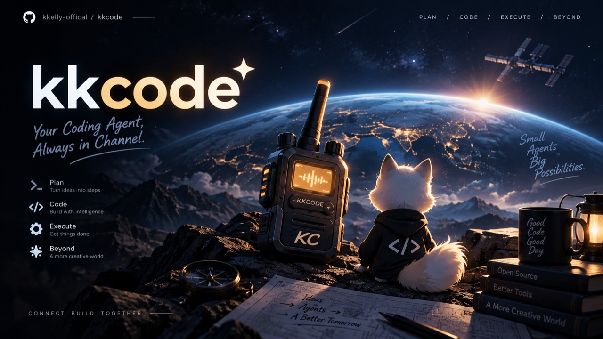

# kkcode



[](https://www.npmjs.com/package/@kkelly-offical/kkcode)
[](https://github.com/kkelly-offical/kkcode/releases)


**Terminal-first coding agent with a five-mode cycle, governed approvals, and staged Ultra delivery.**

**终端优先、可治理、可扩展的编码智能体：五档模式循环、可治理审批、Ultra 分阶段交付。**
kkcode 把问答、规划、事务型修改、多阶段长任务编排放在同一个 CLI 工作台里，并且把权限、预算、审计、后台任务、MCP、技能与插件一起纳入统一执行面。

当前源码正在开发 **`1.0.5-preview.0`，尚未发布**。本轮以可信大任务交付为目标，
完整范围见 [开发计划](docs/plan-1.0.5.md)，已完成与未完成内容见
[实施账本](docs/implementation-1.0.5.md)。持久任务、严格隔离、证据/记忆、多代理、
离线依赖环境、本机浏览器桥接和文档工具已进入源码与本地集成验收；跨平台、真实模型与试用门禁尚未完成，
不能视为已经发行或生产认证。公开稳定版仍以下面的 1.0.4 为准。

验收代码已推送专用分支，尚未合入 main、公开发布或升级生产网关／设备。
真实 GitHub SDK 工程往返已建立 [草稿 PR #5](https://github.com/kkelly-offical/kkcode/pull/5)，
但缺少人工批准，仍是 blocked，不是可合并交付。新版 CI 已运行但尚未全绿，
Chrome/Edge 品牌矩阵失败／受阻；获准的本机 vLLM 真实模型评测正在进行，
60 任务 × 2 轮、GitLab 往返和七天实际试用尚未完成。详见[实施账本](docs/implementation-1.0.5.md)
与[新增 CodeQL 核查](docs/codeql-triage-1.0.5.md)。不使用付费模型或历史 CI 代替当前验收。
`1.1.0` 是后续成熟度目标，不是本次版本号；发布仍需单独确认。

稳定版 **`1.0.4` 已发布**：新增 [OpenAI Responses API](docs/responses-api.md)，
支持文本/图片、流式思考摘要与受控工具循环；修复 SSH 跨设备模型状态、中文错误、
空会话显示和渠道密钥保留。来源链接可由浏览器打开，Thinking 可在生成中展开，
最终回答完成后运行过程收起为可展开的耗时摘要。

包含预览版的 Web/Android 上下文用量、精简改名/归档/删除菜单、并列设备切换、
账号 SSH 地址簿和断线不中断在途任务的 SSH 宿主。**SSH 仅 Android 直连，
Web 不增加 SSH，网关不代连或保管 SSH 私钥。** 提示预算、强类型 SDK、MCP OAuth、
ACP、受控 Browser/Harness 一并保留。

沿用 1.0.3 的 Android SSO 回跳/恢复，以及 1.0.2 的回退、统一 Auto 审查、
分支/Worktree 与安全图片预览。App、设备 CLI 和网关/Web 需要配套升级。
先读 [1.0.4 升级说明](docs/release-1.0.4.md)、[SSH 使用](docs/ssh-account-devices.md)
与 [实际验收/发布回执](docs/stable-1.0.4-worklog.md)。源码版本不等于生产部署完成；
是否公开上线以回执为准。历史预览记录保留在 [preview.0 台账](docs/implementation-1.0.4.md)。


以上为品牌概念图，不是实际界面截图；应用仍使用紧凑的像素主题会话布局。
原始素材与 Android 图标适配记录见 [品牌素材](docs/assets/brand/README.md)。

**日本語**: ターミナル中心の個人アシスタント。安全な権限管理、Coding Agent、LongAgent、ローカル拡張を同じ CLI にまとめます。  
**한국어**: 터미널 우선 개인 비서로, 권한 관리와 Coding Agent, LongAgent, 로컬 확장을 하나의 CLI에서 다룹니다。  
**Español**: asistente personal centrado en terminal para ejecución gobernada, agentes de código, LongAgent y extensiones locales.

---

<a id="table-of-contents"></a>
## Table of Contents / 目录

- [Overview / 概览](#overview)
- [Why kkcode / 为什么选择 kkcode](#why-kkcode)
- [Installation / 安装](#installation)
- [Quick Start / 快速开始](#quick-start)
- [Capability Snapshot / 能力总览](#capability-snapshot)
- [1.0.5 Development / 开发版入口与边界](#development-105)
- [Modes & Ultra / 模式与 Ultra](#modes-and-longagent)
- [Safety & Permissions / 权限与安全](#safety-and-permissions)
- [Delegation & Subagents / 委派与子智能体](#delegation-and-subagents)
- [Integrations / 集成](#integrations)
- [Extensions / 扩展机制](#extensions)
- [TUI & CLI Reference / TUI 与命令参考](#tui-and-cli-reference)
- [Configuration & Project Layout / 配置与项目结构](#configuration-and-project-layout)
- [Model Templates / 模型模板](#model-templates)
- [Release Status / 发布状态](#release-status)
- [Compatibility, Limits & Roadmap / 兼容性、边界与路线图](#compatibility-limits-and-roadmap)
- [FAQ / 常见问题](#faq)
- [Contributing / 贡献](#contributing)
- [License / 许可证](#license)
- [Further Reading / 延伸阅读](#further-reading)

---

<a id="overview"></a>
## Overview / 概览

**English**
- kkcode is a terminal-native unified Assistant designed for local work, governed execution, coding, planning, and multi-stage delivery.
- Everyday work stays in `agent`; the CLI's `Shift+Tab` cycles Plan, Agent, Auto, Ultra and Yolo. Web/Android use one mode picker, with no separate permission chip.
- It is optimized for **CLI-first** and **Ultra-first** workflows rather than GUI-first or marketplace-first product patterns.

**中文**
- kkcode 是一个面向终端原生工作流的统一 Assistant，强调本地事务、可治理执行、编码、规划和多阶段交付。
- 日常工作进入 `agent`；CLI 用 `Shift+Tab` 循环 Plan、Agent、Auto、Ultra、Yolo；Web/Android 用单个模式选择器，不再并列独立权限档。
- 它优先服务 **CLI-first**、**Ultra-first** 的工程工作流，而不是 GUI 优先或 marketplace 优先的平台形态。

---

<a id="why-kkcode"></a>
## Why kkcode / 为什么选择 kkcode

**English**
- **CLI-first**: core workflows stay in the terminal.
- **Ultra-first**: large tasks are planned, staged, and verified instead of improvised in one prompt.
- **Governed execution**: permissions, budgets, audit logs, and recovery are built in.
- **Local extensibility**: MCP, skills, commands, hooks, tools, and custom agents can all be mounted locally.

**中文**
- **CLI-first**：核心工作流都在终端内完成。
- **Ultra-first**：复杂任务先规划、分阶段、带门禁，而不是靠单轮 prompt 硬顶。
- **可治理执行**：权限、预算、审计、恢复、后台任务都是内建能力。
- **本地可扩展**：MCP、skills、commands、hooks、tools、custom agents 都能本地挂载。

---

<a id="installation"></a>
## Installation / 安装

**Requirements / 环境要求**
- Node.js `>=22.12`
- npm or pnpm
- A modern terminal on Windows, macOS, or Linux
- `ripgrep` (`rg` on PATH) for the built-in grep/glob tools; CI installs it explicitly.
- Clipboard support depends on the desktop: PowerShell on Windows, pngpaste/osascript on macOS, wl-paste/xclip on Linux. SSH does not expose the local phone/laptop clipboard to the remote computer.

**Install from npm / 通过 npm 安装**
```bash
npm install -g @kkelly-offical/kkcode
kkcode
```

预览渠道：`npm install -g @kkelly-offical/kkcode@preview`；固定稳定版可使用
`@1.0.4`。本次开发尚未更新 `@preview`，不能用它安装未发布的 `1.0.5-preview.0`；
获取当前正式版用默认渠道或明确版本号，不要把预览标签当作总是最新。安装搜索依赖：Linux `apt install ripgrep`、macOS
`brew install ripgrep`、Windows `choco install ripgrep`。

**Web / enterprise remote / 企业远控**

```sh
kkcode -web                  # 本机 WebUI，默认 18271
kkcode -web -host-18271       # Host 开放，需按部署文档配置访问保护和 TLS
kkcode remote                # 先询问目录范围；前台运行，首次必须登录绑定
kkcode remote --all-folders  # 明确允许所有普通目录，凭据/系统私密路径仍受保护
kkcode remote --home-only    # 仅 home；--root <path> 可限定一个工作目录
kkcode browser install      # 在工作电脑安装 Browser 引擎，非网关/手机
kkcode browser status       # 查询浏览器是否可用，不会自动启动
```

公网服务器部署的是 `apps/gateway/main.mjs` 的**中继网关**，不是运行在工作电脑
上的设备端。SSO 是独立的 OIDC 身份服务；客户端通过网关引导登录。网关停止或
设备终端退出后的行为、账号归属及备份要求见 [企业部署](docs/enterprise-deployment.md)。

**Run from source / 从源码运行**
```bash
git clone https://github.com/kkelly-offical/kkcode.git
cd kkcode
npm ci
npm run start
```

从源码运行反映当前 checkout，不代表已发布稳定包。npm 包提供运行时代码、公开
SDK 类型、选定使用文档和 Office/LSP 镜像构建目录；完整 Android/Web 开发工程、
测试、`scripts/` 和 `evaluation/` 验收资源请使用源码仓库。包内容由 `package.json`
的 `exports`／`files` 定义，可用 `npm pack --dry-run` 核对。

**Useful links / 常用链接**
- [npm package](https://www.npmjs.com/package/@kkelly-offical/kkcode)
- [GitHub Releases](https://github.com/kkelly-offical/kkcode/releases)
- [Example config](docs/config.example.yaml)

---

<a id="quick-start"></a>
## Quick Start / 快速开始

**1. Launch / 启动**
```bash
kkcode
```

**2. Initialize project config / 初始化项目配置**
```bash
kkcode init -y
```

**3. Verify the install / 验证安装**
```bash
kkcode --help
kkcode doctor
```

**First-run behavior / 首次启动行为**
- On first launch, kkcode runs onboarding and records your preferences.
- Use `/profile` to inspect or update personal preferences.
- Use `/like` to rerun onboarding.

**Configuration search order / 配置查找顺序**
- User-level: `~/.kkcode/config.yaml`
- Project-level: `./kkcode.config.yaml` or `./.kkcode/config.yaml`

---

<a id="capability-snapshot"></a>
## Capability Snapshot / 能力总览

| Area / 能力面 | Status / 状态 | Notes / 说明 |
| --- | --- | --- |
| Agent / 统一助手 | Supported | Default CLI lane for Q&A, code edits, reviews, tests, and local automation |
| Plan / 方案规划 | Supported | Read-only planning workflow that saves a plan file, then switches mode to build it |
| Mode cycle / 模式循环 | Supported | CLI `Shift+Tab`: Plan · Agent · Auto · Ultra · Yolo; one picker on Web/Android |
| Ultra / 长程编排 | Supported | Multi-stage execution, retries, gates, resumable flow |
| Permissions / 权限治理 | Supported | Mode-derived policy, same-model Auto review, explicit organization/path rules and manual fallback |
| Conversation management | Supported | Web/Android rename, archive/restore, confirmed rewind and same-first-model titles |
| Git workspaces | Supported | Detailed local/cached-remote refs, safe worktree creation and separate-session opening |
| Browser development tools | Supported, engine installed separately | Isolated Playwright profile, semantic snapshot, click/fill/press, model-visible screenshot; no personal browser takeover |
| OS sandbox / OS 级沙箱 | Supported (opt-in) | `permission.sandbox.mode: auto` wraps model-initiated bash in bubblewrap (Linux) or sandbox-exec (macOS) |
| Shell passthrough / Shell 直通 | Supported | `!<command>` runs in your own shell — never sandboxed, never sent to the model |
| Ghost text / 输入预测 | Supported | Inline next-phrase prediction when `models.fast` is configured |
| Background tasks / 后台任务 | Supported | Launch, inspect, wait, retry, cancel; completion wakes the main agent |
| MCP / 模型上下文协议 | Supported | Local MCP discovery and registry |
| Skills / Commands / Hooks | Supported | Local-first extensibility surface |
| Plugins / 插件包 | Preview | Local kkcode / Claude Code / Codex / OpenCode compatibility baseline |
| GUI / IDE / desktop automation | Not promised | README does not claim GUI-first product support |

For a deeper boundary matrix, see [CLI General Assistant Capability Matrix](docs/cli-general-assistant-capability-matrix.md).

---

<a id="development-105"></a>
## 1.0.5 Development / 开发版入口与边界

以下是**未发布源码**的使用入口，不是上表稳定版能力已经全部升级的声明。
普通聊天／原有 Ultra 不会自动取得严格任务的隔离、预算或验收合同。

| 方向 | 已接入的入口 | 必须保留的边界 |
| --- | --- | --- |
| 可恢复任务 | [`kkcode runs`](docs/trusted-runs.md)、`sdk/runs`、`sdk/tasks` | 宿主确认合同、独立工作树、固定镜像、持久总预算；未知副作用先核查，不重放；完成由独立验收决定 |
| 上下文与证据 | [原生／本地压缩](docs/context-and-harness.md)、[`artifact_read` / `artifact_search`](docs/sdk-storage.md) | 大输出先归档再显示截断；命中项 `readCursor` 可直达正文，每次仍核验账号／项目／会话／任务；不恢复历史上已丢弃内容 |
| 多端监督 | [Web/Android 委托任务](docs/task-monitoring.md)、[记忆管理](docs/scoped-memory.md) | 设置内查看状态、额度、验收与产物；所有者确认暂停／取消，共享访客只读；新建／接管／最终交付仍在可信宿主 |
| 离线依赖 | [`kkcode environments`](docs/dependency-environments.md)、`sdk/environments` | npm v2/v3 lock、SRI、单独安装脚本批准、只读挂载；不自动联网安装，不支持 workspaces 或所有包管理器 |
| Browser / Bridge | [隔离 Browser](docs/browser-workflows.md)、[本机 Bridge](docs/browser-bridge.md)、[实验 Recipe](docs/browser-recipes.md) | Bridge 仅主 frame 文本／引用交互，无全局按键；截图需另行本机同意，可含嵌入内容，非像素级 origin 隔离；Recipe 审核、验证、锁版后仍逐叶治理 |
| Office / LSP | [`kkcode services`](docs/host-services.md)、[`office`](docs/office-tools.md)、[`lsp`](docs/language-services.md) | 固定镜像、受控离线工作目录、原件保留；格式／语言有明确支持范围，不承诺任意文档无损或完整 IDE 替代 |
| 协议与插件 | [MCP/ACP/Skills](docs/protocol-extensions.md)、[插件完整性](docs/plugin-integrity.md) | 用户表单真实确认，schema 有界隔离验证；托管插件来源／内容锁定，新代码或能力升级需确切哈希批准 |
| 交付与诊断 | [Forge](docs/forge-delivery.md)、`runs diagnose`、`sdk/diagnostics` | 固定仓库／分支／候选和真实回执；携带令牌的 `forge inspect` 也须先核对来源再精确确认；不自动合并、部署、发版 |

[SDK 总览](docs/sdk-guide.md) 列出公开分域导入路径与远程能力协商。
[严格 Browser 实机验收](docs/browser-strict-acceptance.md) 明确区分 root 下功能 fixture
与非 root Chromium 沙箱证据；`blocked`／`skip` 都不是验收通过。
[60 任务评测](docs/evaluation-suite.md) 区分零费用 oracle 自检与真实模型成绩。

---

<a id="modes-and-longagent"></a>
## Modes & Ultra / 模式与 Ultra

### The mode cycle / 模式循环

Press `Shift+Tab` to walk the five public modes. `/mode` opens a picker,
`/mode <id>` switches directly.

按 `Shift+Tab` 循环五个公开模式；`/mode` 打开选择面板，`/mode <id>` 直接切换。

| Mode | Lane | Approval | Purpose |
| --- | --- | --- | --- |
| ⏸ `plan` | plan | readonly | read-only planning; never mutates files |
| ● `agent` | assistant | manual | **default** — edits are confirmed before they land |
| ▶ `auto` | assistant | accept-edits + same-model review | ordinary edits run; sensitive actions get one bounded review, uncertainty asks you |
| ⚡ `ultra` | longagent | Auto review | staged persistent delivery with gates, checkpoints, budget and resume |
| ☠ `yolo` | assistant | yolo | autonomous within authorized scope; hard safety rules remain |

**English**
- A single mode determines orchestration and approval behavior. Auto uses the conversation's actual provider/model for tool-free sensitive-action review, never a separate review model. Hard denials and explicitly manual governance rules are not delegated.
- `agent` is the default unified lane for questions, coding, review, tests, and automation.
- Use `/ultra` explicitly when the task is clearly multi-stage or system-wide.
- Interrupted work can be resumed with the same session context.

**中文**
- 一个模式同时确定编排与审批行为。Auto 使用当前对话模型审查敏感操作，审查失败或不确定时交给用户；硬拒绝、受保护路径和显式人工规则不可被模型绕过。
- `agent` 是默认统一入口，承接问答、编码、审查、测试和自动化。
- 任务明显跨文件、跨阶段、影响面较大时，显式使用 `/ultra`。
- 中断后的工作可以在同一会话中继续，不需要从零开始。
- **路由理由可见**：当 kkcode 建议使用 `ultra` 时，会解释为什么当前任务更适合重型工作流。

### Compatibility / 兼容旧写法

1.0.2 的 `/auto`、`/mode auto` 替代 `agent-auto`；旧模式名仍作为输入别名接受。
以下旧 **permission 配置键** 的移除规则不受影响：模式 `auto` 不是一个旧权限等级。

0.3.x spellings were removed in 0.6.0. `permission.mode`,
`permission.default_policy` and the old level names now raise a config error
that names the replacement — they are rejected rather than ignored, because a
permission tier decides what runs without asking and silently defaulting would
leave you believing you are locked down when you may not be.

| Old / 旧写法 | New / 新写法 |
| --- | --- |
| `permission.mode` | `permission.level` |
| `default_policy: allow` | `level: accept-edits` |
| `review` / `auto` | `manual` |
| `edit` / `full-auto` | `accept-edits` |

0.3.x 的写法已在 0.6.0 移除。`permission.mode`、`permission.default_policy`
与旧等级名现在会报配置错误并指出替代写法 —— 选择报错而不是忽略，是因为权限档
决定哪些工具不经确认就能跑，静默回落会让你以为自己还锁着。

| 0.3.x | 0.4.0 |
| --- | --- |
| `/longagent` | `/ultra` |
| `assistant` / `agent` / `code` / `coding` | `agent` |
| `permission.level: review` / `auto` | `manual` |
| `permission.level: edit` / `full-auto` | `accept-edits` |
| `permission.mode` / `permission.default_policy` | `permission.level` |

Lane identifiers (`assistant` / `plan` / `longagent`) are unchanged, so
sessions, hooks and `permission.rules[].modes[]` keep working.

航道标识（`assistant` / `plan` / `longagent`）保持不变，会话、hooks 与
`permission.rules[].modes[]` 都不受影响。

### CLI 统一 Assistant 能力边界（0.3.0）

**公共模式契约**

- `agent`：默认统一助手，承接问答、本地检查、编码修改、测试验证、审查、网页查询、Git/GitHub、笔记和任务整理。0.3.x 的 `assistant` 归一到这里。
- `/plan`：**只读编写开发计划**，保存计划文件后提供 Build / Ultra Build / compact 执行选择，选定后**真正切换模式并开始执行**。
- `assistant` / `agent` / `code` / `coding`：兼容别名，内部归一为 `agent` 模式（`assistant` 航道）。
- `/ultra`：显式重型开发模式，用于跨文件、多阶段、需要恢复和验收的任务。

**能力边界速览**
- 系统 / 运行时信息
- 本地目录 / 文件 / 日志检查
- 仓库 / 发布辅助
- 这**不代表** kkcode 已经承诺 GUI / 桌面自动化能力
- 默认先在 `assistant` 内处理普通终端事务和编码小闭环；只有明确重型任务才提示 `/ultra`

**Further reading / 延伸阅读**
- [0.4.0 Mode & Approval Contract](docs/kkcode-0.4.0-mode-contract.md)
- [0.1.13 Mode Lane Contract](docs/kkcode-0.1.13-mode-lane-contract.md)（历史归档）
- [Agent Mode Tolerance Contract](docs/kkcode-0.1.12-agent-mode-tolerance-contract.md)

---

<a id="safety-and-permissions"></a>
## Safety & Permissions / 权限与安全

**English**
- kkcode uses a policy-driven permission model with optional approvals.
- Session-scoped grants can reduce repeated prompts while preserving boundaries.
- Budget and usage controls are designed to keep long-running sessions governable.

**中文**
- kkcode 使用策略驱动的权限模型，并可叠加交互式审批。
- 会话级授权缓存可减少重复确认，同时保持边界清晰。
- 预算与用量控制让长会话、长任务仍然处于可治理状态。

**Policy examples / 策略示例**
- `permission.level: readonly | manual | accept-edits | yolo`
- switching mode rewrites the level; `/permission cycle` walks it independently
- rule-based overrides by tool / mode / file pattern / command prefix / workspace
- `permission.mode` and `permission.default_policy` are legacy fields that now map onto `permission.level`

**Always Allow / 持久授权**

The approval prompt offers `Allow Once`, `Allow Session`, `Always Allow` and
`Deny`. **Always Allow** writes a rule into the **user** config with a
`workspace` field scoping it to the current project, so the grant survives a
restart without leaking into other repositories or into your git history.
Manage them with `/permission list` and `/permission forget <n|all>`.

审批弹窗提供 `Allow Once` / `Allow Session` / `Always Allow` / `Deny` 四项。
**Always Allow** 会把规则写入**用户级**配置并带上 `workspace` 限定，重启后依然
有效，同时不会泄漏到其他仓库或用户的 git 历史。可用 `/permission list` 查看、
`/permission forget <n|all>` 撤销。

**OS-level sandbox / OS 级沙箱（0.8.1, opt-in）**

Permission rules decide *whether* a command runs; the sandbox bounds *what it
can reach* if it does. It is the third line of defence behind rules and
approvals, and it is **off by default** — turning it on changes how existing
commands execute, so it is never enabled for you.

```yaml
permission:
  sandbox:
    mode: "off"          # off | auto
    network: true        # false = no network at all (own netns, localhost included)
    writable_dirs: []    # add what your toolchain needs, e.g. ["~/.npm", "~/.cache"]
```

With `mode: auto`, model-initiated bash runs under **bubblewrap** (Linux) or
**sandbox-exec** (macOS): the whole filesystem is read-only except the
workspace, the system tmp dir, `~/.kkcode`, and anything you add to
`writable_dirs`. Background tasks are wrapped too — leaving that lane
unwrapped would just be a bypass switch. Commands **you** type with `!` are
never sandboxed. The effective backend is visible in `/status` and
`kkcode doctor`; when `auto` finds no usable backend the tool output says so
once rather than pretending isolation is active. A misspelled `mode` is a
schema error, not a silent fallback — the runtime would treat it as `off`,
and you would think you were sandboxed.

权限规则决定命令**能不能跑**，沙箱决定它跑起来**够得到什么**，是规则与审批之后
的第三道防线。**默认关闭**：打开会改变现有命令的执行方式，所以绝不替你启用。
`mode: auto` 后，模型发起的 bash 经 bubblewrap（Linux）/ sandbox-exec（macOS）
执行 —— 整个文件系统只读，仅工作区、系统 tmp、`~/.kkcode` 和你补充的
`writable_dirs` 可写；`network: false` 另断网络（独立 netns，连 localhost 一起
断）。后台任务同样包住，否则它就是一个绕过沙箱的开关；你自己敲的 `!` 命令永远
不进沙箱。生效后端在 `/status` 与 `kkcode doctor` 里可见；`auto` 但后端不可用时
工具输出会说明一次，而不是假装隔离生效。`mode` 打错是 schema 报错而非静默回落
—— 运行时会当成 `off`，而你以为自己在沙箱里。

沙箱内的失败会带一行提示指明可写目录，让模型把 `EROFS` 读成策略而不是机器坏了。
注意 npm/pip 这类工具通常需要把 `~/.npm`、`~/.cache` 加进 `writable_dirs`。

---

<a id="delegation-and-subagents"></a>
## Delegation & Subagents / 委派与子智能体

**English**
- kkcode supports bounded delegation through the `task` surface.
- Assistant mode may call subagents directly when the user explicitly asks for one or more agents.
- Use `task_group` to launch multiple parallel background subagents as one observable group.
- Use `kkcode agent list --json` to inspect built-in, custom, and configured subagent roles.
- Use `fresh_agent` for isolated implementation work.
- Use `fork_context` for read-only sidecar work such as research or verification.
- Do not outsource core understanding when the main thread must synthesize the result.

**中文**
- kkcode 通过 `task` 能力支持有边界的委派。
- 当用户显式要求一个或多个智能体工作时，Assistant 模式可以直接调用子智能体。
- 使用 `task_group` 可以把多个后台子智能体作为同一个并行组启动和观察。
- 使用 `kkcode agent list --json` 查看内置、自定义和配置覆盖后的子智能体角色。
- `fresh_agent` 适合隔离实现任务。
- `fork_context` 适合研究、审计、验证这类只读 sidecar 任务。
- 如果主线程必须综合判断，就不要把理解工作本身外包出去。

**Background task contract / 后台任务契约**
- 通过 `background_output` 查看后台任务输出
- 通过 `kkcode background parallel` 查看并行子智能体分组和 lane 状态
- 通过 `background_cancel` 取消后台任务
- `isolation="worktree"` 的任务完成后变更保存在独立 worktree，**不会**自动进入工作区；用 `kkcode background apply --id <task_id>` 回收（`--dry-run` 预检、`--force` 越过脏区重叠保护），或用 `kkcode background discard --id <task_id>` 丢弃
- 终态固定为 `completed` / `cancelled` / `error` / `interrupted`

**Further reading / 延伸阅读**
- [Task Delegation Contract Matrix](docs/task-delegation-contract-matrix.md)
- [Agent / LongAgent Extension Guide](docs/agent-longagent-compat-extension-guide.md)

---

<a id="integrations"></a>
## Integrations / 集成

### MCP
- Discover local MCP definitions and mount tools into the runtime.
- Inspect registered MCP servers from the CLI.
- Use MCP as part of the same governed tool surface.

### GitHub
- Authenticate, inspect repositories, and run GitHub-related flows from the terminal.
- Repository helpers live under `src/github/`.

### Git automation
- Local git-aware helpers support safe status, patch, and snapshot workflows.
- See [GIT_AUTO_USAGE.md](docs/GIT_AUTO_USAGE.md).

---

<a id="extensions"></a>
## Extensions / 扩展机制

**Local-first extension surface / 本地优先扩展面**
- commands
- skills
- agents
- tools
- hooks
- plugin manifests

**Directory conventions / 目录约定**
- `.kkcode/commands/`
- `.kkcode/skills/`
- `.kkcode/agents/`
- `.kkcode/tools/`
- `.kkcode/plugins/`
- `.kkcode/hooks/`
- `.kkcode-plugin/plugin.json`

**English**
- kkcode’s extension story is local-first and explicit.
- Plugins are currently an MVP surface, not a marketplace platform promise.

**中文**
- kkcode 的扩展机制是本地优先、显式可控的。
- 当前插件能力是 MVP，不代表已经承诺 marketplace 平台形态。

1.0.5 开发版为 `plugin install/update/approve` 加入私密来源与内容锁、不可变加载
副本和新增能力重新批准。显式作者维护的未托管目录保持原有工作区信任语义，
不是自动变成已沙箱化插件；详见 [插件完整性与升级](docs/plugin-integrity.md)。

**Further reading / 延伸阅读**
- [ClaudeNext Agent / LongAgent Skills Compatibility](docs/claudenext-agent-longagent-skills-compat.md)
- [Agent / LongAgent Extension Guide](docs/agent-longagent-compat-extension-guide.md)

---

<a id="tui-and-cli-reference"></a>
## TUI & CLI Reference / TUI 与命令参考

### Common TUI slash commands / 常用 TUI slash 命令
- `/help` — show help
- `/status` — show runtime and operator status
- `/commands` — inspect command / skill / capability surface
- `/reload` — reload commands, skills, and agents
- `/new`, `/resume`, `/history` — session lifecycle
- `/provider`, `/model` — provider/model switching; `/model` also offers a
  thinking-effort tier that is persisted per model
- `/permission` — permission policy management
- `/theme` — switch dark / light / auto at runtime, with live preview on the
  arrow keys, `Enter` to save and `Esc` to revert (`auto` probes the terminal
  background via OSC 11)
- `/btw <question>` — side question: it can see the conversation but cannot
  change it. No tools, no main system prompt, answer renders in a read-only
  panel and never enters the transcript, so it costs nothing on later turns
- `/create-skill`, `/create-agent` — generate local extensions
- `$<skill> [args]` — invoke a registered skill; `/` remains for built-in slash commands
- `!<command>` — run a command in your own shell (see below)

**Interrupt semantics / 中断语义**
- `Esc` 可用于**中断当前 turn**、退出部分选择态或拒绝当前交互式请求，具体行为取决于当前上下文。

**Steering a running turn / 给正在跑的回合插话**

Press `Enter` while the model is working to queue a message; press `Enter`
once more on the empty input and it is promoted to an **interjection**,
injected as a user message at the next step boundary so the model sees it
before finishing. Injection only happens at step boundaries — splicing into an
assistant→tool pair would be rejected by the provider.

忙碌时 `Enter` 排队，空输入框上再按一次 `Enter` 升级为插话，在下一个 step 边界
作为 user 消息注入，模型收尾前就能看到。

**Shell passthrough / Shell 直通**

`!<command>` runs in your own shell. It is *your* command, so it skips
approval and is never sandboxed; stdout and stderr interleave in arrival
order, get middle-truncated (errors at the tail, echo at the head) and land in
the conversation with ANSI stripped — so the model's next turn can see that
you ran it and what came back. `!=` at the start is treated as an expression,
not a command.

`!命令` 在你自己的 shell 里跑：是你的命令，所以不走审批、永不进沙箱；输出剥掉
ANSI 后进会话，模型下一轮看得见。`!=` 开头按表达式处理，不当命令。

**AFK question auto-skip / 挂机提问打发**

A model question left unanswered with no keypress for
`ui.afk_question_timeout_s` seconds (default `600`, `0` disables) resolves as
"skipped" so a long run does not hang on one question while you are away; any
key resets the clock. Pending **human permission prompts are never answered by
the AFK timer**. Auto review runs separately before a human prompt is created.

提问挂起且无任何按键超过 `ui.afk_question_timeout_s` 秒（默认 600，0 关闭）即按
「跳过」结掉，挂机的长任务不再被一个问题卡死；任何按键都会把表拨回起点。
**已发给用户的权限审批不会被 AFK 定时器自动处理**。Auto 模型审查在人工审批前单独进行，不是挂机超时放行。

### v0.3.3 terminal interaction / 终端交互

- Drag in the transcript to select and request a clipboard copy; use the wheel
  to scroll, click the composer to place the real terminal cursor, and click a
  collapsed Thinking/tool block to inspect its details.
- 在对话区拖动即可选择并请求复制文字；滚轮可浏览历史，点击输入框会移动真实终端
  光标，为中文输入法候选窗提供实际输入锚点；点击折叠的 Thinking/工具日志可展开详情。
- Completed reasoning becomes a collapsed `Thinking · Ns` row. While it is
  running, an animated indicator and elapsed time remain visible.
- Mode, model, provider, permission, reconnect, and clipboard notices use
  transient bottom toasts instead of permanently occupying the transcript.
- Assistant output renders terminal-safe Markdown. Tool activity is muted gray;
  code mutations expose bounded red/green `-`/`+` diffs on demand.
- `Ctrl+T` toggles the latest Thinking details, `Ctrl+E` toggles the latest
  expandable block, and `Ctrl+Y` toggles automatic copy-on-select. On Unix,
  `Ctrl+Z` restores terminal state before suspending and redraws after `fg`.

If a terminal reserves mouse reporting differently, hold its native selection
modifier (commonly Shift), or set `ui.terminal.mouse: never` to return native
selection and copying of the visible frame to the terminal. In that mode the
wheel no longer controls KK Code's transcript; use `Ctrl+Up` / `Ctrl+Down` and
`Ctrl+Home` / `Ctrl+End` to browse the application history. See the
[0.3.3 terminal experience guide](docs/terminal-experience-0.3.3.md) for the
Windows, macOS, Linux, SSH/tmux, clipboard, and fallback matrix.

Automated protocol and layout tests cannot validate a GUI terminal's actual
mouse reporting, clipboard permissions, or IME candidate-window placement.
`v0.3.3` ships these terminal paths with automated coverage and documented
fallbacks. Behavior can still vary across Windows Terminal + PowerShell,
macOS Terminal/iTerm2, and Linux Wayland/X11 environments; please report mouse,
clipboard, or IME regressions with the terminal emulator, shell, and multiplexer
details.

### Main CLI commands / 主要 CLI 子命令
- `chat`
- `session`
- `background`
- `agent`
- `ultra`
- `mcp`
- `skill`
- `config`
- `doctor`
- `preflight`
- `model`
- `usage`
- `review`
- `audit`

Run `kkcode --help` or `kkcode <command> --help` for the full surface.

1.0.5 源码新增／扩展的宿主入口：

```sh
kkcode runs --help                 # 任务准备、执行、状态、恢复、验收和交付
kkcode runs backup --help          # 备份/验证；恢复到新目录，不覆盖活动账本
kkcode artifacts --help            # 本机巡检与显式可恢复隔离，不是任意文件下载
kkcode environments --help         # inspect / prepare / verify 离线 npm 环境
kkcode services --help             # Office/LSP 用户私密配置，先预览再确认哈希
kkcode office --help
kkcode lsp --help
kkcode browser bridge --help       # 本机扩展授权；截图额外 --allow-screenshots
kkcode browser recipe --help       # record / review / validate / enable / run
kkcode plugin --help               # 托管安装、内容批准及升级
```

这些是本机可信宿主操作，不等于把同名管理接口开放给模型或网关访客。依赖环境
准备后，`runs start --environment <目录>` 才明确选用它；环境、镜像或清单改变
都要重新核验，不会自动采用任意已有 `node_modules`。

---

<a id="configuration-and-project-layout"></a>
## Configuration & Project Layout / 配置与项目结构

### Key config themes / 关键配置主题
- provider/model selection — including per-model thinking effort
- permission and trust policy
- OS sandbox — `permission.sandbox.{mode,network,writable_dirs}` (opt-in)
- mode, approval and Ultra behavior
- usage and budget limits
- UI / theme settings — `ui.status.segments` picks which status-bar segments
  show and in what order (`mode | model | tokens | cost | context | memory |
  permission | longagent`); leaving it unset keeps the current bar
  byte-for-byte, and unknown names are schema errors
- `ui.afk_question_timeout_s` — auto-skip an unattended question (default 600s)
- MCP and extension loading

The annotated reference config is [docs/config.example.yaml](docs/config.example.yaml);
it tracks the schema, so prefer it over this summary when the two disagree.

### Dynamic models and unified gateway / 动态模型与统一网关

`v0.3.3` reads the model catalog from the Base URL you configure. OpenAI-compatible
and Anthropic-compatible services can share one gateway entry:

```yaml
provider:
  default: company-gateway
  company-gateway:
    type: gateway
    protocol: openai # or anthropic
    base_url: https://gateway.example.com
    endpoints:
      openai: /v1
      anthropic: /anthropic/v1
      models: /v1/models
    api_key_env: KK_GATEWAY_API_KEY
    default_model: model-id-from-the-catalog
    discovery:
      enabled: true
      cache_ttl_ms: 900000
```

```bash
kkcode model list --provider company-gateway --refresh
kkcode model test --provider company-gateway --model model-id
kkcode model test --provider company-gateway --model model-id --probe
```

The last command is the only one above that performs a potentially billable
inference request. Catalog redirects and pagination must remain on the configured
origin. Discovery failures are explicit; KK Code may report a stale cache, but
does not silently substitute a built-in model list. Project-controlled provider
URLs and credential settings are blocked until the workspace is trusted.
Credential-bearing connections require HTTPS; authentication-free local HTTP
gateways remain available for development. See
[Gateway and model discovery](docs/gateway-model-discovery.md) and
[`configs/config-gateway.yaml`](configs/config-gateway.yaml).

### Audit and branch review / 审计与分支审查

```bash
kkcode audit verify
kkcode audit list --provider company-gateway --since 2h
kkcode review branch --base origin/main --include-working-tree
kkcode review gate
kkcode review waive <finding-id> --reason "accepted risk"
kkcode review branch --pr 123 --publish
```

Audit records form a rotating SHA-256 chain and keep prompts/model output out of
the log body. Branch review combines deterministic checks with structured model
findings; stale, incomplete, critical, and high-severity reports fail closed.
One review trace correlates its model calls, permission decision, PR publication,
waiver, and gate result. Candidate credentials are redacted before a diff is sent
to the review model.

### Project structure / 项目结构
- `src/repl.mjs` — main REPL assembly surface
- `src/repl/` — extracted REPL seams
- `src/ui/` — REPL panels and render helpers
- `src/kernel/` — the kernel: `session/` (execution loop, memory, recovery, prompts),
  `orchestration/` (background and Ultra orchestration), `skill/` / `plugin/` / `mcp/`
  (extension systems), `tool/` / `permission/` / `provider/` / `core/`;
  frontends import only `src/kernel/index.mjs` (facade whitelist, enforced in CI)

**Useful docs / 推荐文档**
- [Example config](docs/config.example.yaml)
- [Multi-provider template](configs/config-multi-provider.yaml)
- [Gemini template](configs/config-gemini.yaml)
- [Kimi template](configs/config-kimi.yaml)
- [Kimi Code template](configs/config-kimi-code.yaml)
- [xAI template](configs/config-xai.yaml)
- [REPL roadmap](docs/repl-roadmap-0.1.27-0.1.36.md)

---

<a id="model-templates"></a>
## Model Templates / 模型模板

The `configs/` directory contains provider-ready templates for current OpenAI-compatible, Anthropic, DashScope, DeepSeek, GLM, Gemini, Kimi Code, Moonshot Kimi, xAI, and Ollama setups. The default examples prefer stable aliases where vendors publish them, and keep deprecated aliases only when they are still useful for migration.

`configs/` 目录包含 OpenAI-compatible、Anthropic、DashScope、DeepSeek、GLM、Gemini、Kimi Code、Moonshot Kimi、xAI 和 Ollama 的可用模板。默认示例优先使用厂商稳定别名；即将废弃的旧别名只保留为迁移兼容项。

| Provider | Default template model | Notes |
| --- | --- | --- |
| OpenAI | `gpt-5.6-terra` | The balanced tier of the 5.6 family; `gpt-5.6-sol` for the hardest work, `gpt-5.6-luna` for cost, `gpt-5.3-codex` for the coding lane |
| Anthropic | `claude-sonnet-5` | Balanced default; `claude-opus-5` for highest-complexity work, `claude-haiku-4-5` for the fast lane |
| DashScope / Qwen | `qwen3.5-plus` | The `qwen3.5` template tracks that series. Alibaba's current lineup is `qwen3.7-max` / `qwen3.7-plus` / `qwen3.6-flash` — a 3.7 template is [on the roadmap](docs/ROADMAP.md) |
| DeepSeek | `deepseek-v4-flash` | Current, alongside `deepseek-v4-pro`; replaces the old `deepseek-chat` / `deepseek-reasoner` aliases |
| Zhipu GLM | `glm-5.1` | New GLM default with `glm-5` and `glm-4.5` kept as fallback choices |
| Google Gemini | `gemini-3.6-flash` | Uses Gemini's OpenAI-compatible endpoint; `gemini-3.5-flash` kept as a fallback |
| Kimi Code | `k3` | Uses the dedicated Coding API and `KIMI_CODE_API_KEY`; also includes Kimi for Coding variants |
| Moonshot Kimi | `kimi-k3` | Current Kimi model for coding/agent work; `kimi-k2.7-code` and `kimi-k2.6` kept as fallbacks |
| xAI Grok | `grok-4.5` | xAI's current default for both chat and code; `grok-4.3` kept as a fallback |

**日本語**: 最新テンプレートは安定版エイリアスを優先し、移行中の旧モデル名は互換用途としてのみ残しています。  
**한국어**: 최신 템플릿은 안정 별칭을 우선 사용하고, 이전 모델명은 마이그레이션 호환용으로만 유지합니다.  
**Español**: las plantillas priorizan alias estables y conservan nombres antiguos solo para migración.

Reviewed source pages on 2026-08-06: [OpenAI models](https://developers.openai.com/api/docs/models/all),
[Claude models](https://platform.claude.com/docs/en/about-claude/models/overview),
[Alibaba Cloud Model Studio models](https://www.alibabacloud.com/help/en/model-studio/models),
[DeepSeek API](https://api-docs.deepseek.com/), [Gemini models](https://ai.google.dev/gemini-api/docs/models),
[Kimi model list](https://platform.kimi.ai/docs/models), and [xAI models](https://docs.x.ai/developers/models).
**Zhipu GLM was not re-verified in this pass** — its docs site renders the model
list client-side, so the GLM row still reflects the 2026-05-27 review. Treat that
one row as older than the rest rather than assuming it was checked.

---

<a id="updates"></a>
## Updates / 更新

KKCode checks npm dist-tags in the background on startup and caches the result under `~/.kkcode/update-state.json`. By default it only prints a notice; it does not modify your global install unless you explicitly run the updater.

One-click upgrade / 一键升级: `kkcode update --install`. When a newer release is found, the TUI shows a startup toast with the same command, and the current version stays visible at the right end of the bottom hint line. 启动时发现新版本会在 TUI 里弹出提示；当前版本号常驻显示在底部提示行右侧。

```bash
kkcode update --check
kkcode update --install --channel latest
kkcode update --install --channel preview
```

Config:

```yaml
update:
  enabled: true
  notify_on_startup: true
  auto_install: false
  channel: "latest"
  check_interval_hours: 12
```

<a id="release-status"></a>
## Release Status / 发布状态

**Current stable / 当前稳定版本**: [`v1.0.4`](https://github.com/kkelly-offical/kkcode/releases/tag/v1.0.4)，npm `latest` 与 Android `10008` 已上线，发布门禁与公开下载回执见 [实施台账](docs/stable-1.0.4-worklog.md)。

**Opt-in preview / 自愿试用预览版**: [`v1.0.4-preview.0`](https://github.com/kkelly-offical/kkcode/releases/tag/v1.0.4-preview.0)，发布回执见 [实施台账](docs/implementation-1.0.4.md)。

**Development only / 仅开发中**: `1.0.5-preview.0`；没有 npm/GitHub 发版回执，
没有自动更新生产网关或设备。该工作树不能替换上面的稳定版发布状态。

1.0.4 正式发布已推进 npm `latest`，不移动任何旧版本标签，未发行 `1.0.4-preview.1`。
新客户端、设备 CLI、企业网关/Web 镜像需按 [升级说明](docs/release-1.0.4.md) 配套更新。

```sh
npm install -g @kkelly-offical/kkcode@1.0.4
kkcode --version
```

Version 1.0.4 adds OpenAI Responses, clearer remote errors, isolated SSH device settings,
clickable sources, live thinking expansion and completed-run summaries. It promotes the
context, SSH lifecycle, SDK, protocol and Harness work from preview.0 to the stable line.
Version 1.0.3 fixes native Android SSO return, encrypted login recovery, cancellation,
retry handling and identity restoration without automatic device connection.
Version 1.0.2 adds session lifecycle controls, unified modes with same-model Auto review,
safe worktrees, Browser tools, first-question titles and authenticated image previews.
It retains the 1.0.1 WebUI/Host, enterprise OIDC/Relay, native Android remote control,
multi-client approvals, attachments and guarded Git branches. The second preview
adds SSE event streams, tolerant home-root folder browsing (credential protection
unchanged), Web/Android model/mode selectors with dual themes, the
controlled terminal status mode, and agent workflow/tools compatibility fixes with
model-catalog origin markers. Stable 1.0.1 additionally brings GitHub-backed Android
updates, pixel visual themes without control relocation, explicit remote folder
consent and stricter vLLM-compatible request shaping. See the
[release guide](docs/release-1.0.4.md)
for migration, Android installation, enterprise deployment and acceptance limits.
预览渠道仍需主动安装；首次启用远控前请阅读账号归属、目录授权和备份说明。

The earlier `1.0.1-preview.2` completed M32/M33 and the named M28 follow-ups: background
MCP loading, compact CLI notices/theme/turn lifecycle fixes, real audio/video
input encoding with capability gates, discovered pricing in cost accounting,
capability badges, owner-only remote MCP summaries, deferred tool discovery,
root-to-cwd instructions, canonical tool advertising and enforced skill flags.

此前 `1.0.1-preview.2` 补齐：后台 MCP、CLI 提示/主题/结束状态、音视频实际请求编码、
目录定价计费、能力徽标、远端 MCP 摘要、`tool_search`、分层指令、兼容别名下的
统一工具入口和 skill 限制。图片/音视频支持不是“所有模型都支持”；音视频能力
未知或协议不兼容时明确拒绝，图片保留既有的未知能力放行行为。`?` 徽标只表示
名称推断。定价是成本估算，不是供应商账单。
详见 [媒体输入矩阵](docs/media-input.md)、[工具与技能契约](docs/tool-discovery-and-skills.md)。

The earlier `v1.0.0` established the five stages of the
kernel/SDK layering, the frozen headless JSONL machine contract, and the four
pre-release backlog items, all retained in 1.0.1.

`v1.0.0` 建立的内核/SDK 分层、固化的 headless JSONL 机器契约与四条 backlog
继续保留在 `1.0.1` 中。

Use the Kimi Code preset without placing credentials in YAML:

```bash
export KIMI_CODE_API_KEY="..."
cp configs/config-kimi-code.yaml kkcode.config.yaml
kkcode doctor --http
kkcode chat "review this repository" --output-format text
```

`--output-format` supports `text`, `json`, `stream-json`, and the interactive-compatible
`legacy` format. In non-interactive use, progress goes to stderr and the final answer
goes to stdout. With `json` / `stream-json`, stdout is a pure JSONL machine contract —
one JSON event per line, every line carrying `schemaVersion` and a `type` from the
contract table (`turn.result`, `assistant.delta`); see
[docs/headless-jsonl-contract.md](docs/headless-jsonl-contract.md) for the event table
and stability commitments. `doctor --http` shows the effective `KK-Code/<version>`
request identity with authorization values redacted.

**Latest releases / 最新发布**: [GitHub Releases](https://github.com/kkelly-offical/kkcode/releases)  
**Package / 包地址**: [npm](https://www.npmjs.com/package/@kkelly-offical/kkcode)

**English**
- `1.0.0` ships the five-stage in-process kernel/SDK layering and the frozen
  headless JSONL machine contract: the boot sequence is consolidated into a
  single `createKernel()` composition root, the kernel subdomains live under
  `src/kernel/` behind a facade whitelist enforced by lint in CI, and `kkcode
  chat --output-format json|stream-json` emits pure JSONL on stdout with
  progress, diagnostics, and prompts kept to stderr. Four pre-release backlog
  items land with it: `turn.result` failure semantics tightened (provider-level
  failures now report `status: "failed"` and exit non-zero instead of looking
  successful), the typecheck gate closed over the tree with the remaining
  legacy `checkJs` errors cleaned out domain by domain, `kkcode review branch
  --publish` wired into TTY approval handlers (plus a new `--trust` flag), and
  `src/agent/` moved in as the tenth kernel subdomain.
- `0.9.4` is a test-portability hotfix: the background-apply tests now
  normalize CRLF line endings on read-back and pin `core.autocrlf=false` in
  their temporary repos, so Windows runners with `autocrlf=true` no longer
  break the strict LF assertions that blocked the 0.9.3 release workflow at
  `matrix_verify`. No runtime behavior changes — this release exists so the
  fully automated pipeline (`matrix_verify` → `release_verify` → npm publish
  → GitHub release) runs green end to end on an immutable tag.
- `0.9.3` closes the worktree handoff loop: a background task delegated with
  `isolation="worktree"` keeps its changes in a preserved detached worktree,
  and `kkcode background apply --id <task_id>` now brings them back into the
  main checkout while `kkcode background discard --id <task_id>` drops them.
  Apply is all-or-nothing by default — overlapping-uncommitted-change guard
  (`--force` to bypass), `git apply --check` preflight, a ghost-commit
  snapshot recorded before mutation, and an atomic apply; `--3way` is an
  explicit opt-in, `--dry-run` inspects without touching anything. Task
  summaries and the completion wake now state that worktree changes are NOT
  yet in the workspace, and `background clean` skips preserved worktrees
  instead of orphaning them.
- `0.9.2` hardens undo snapshots, layered configuration validation, stable
  transcript scrolling, Vitest foreground detection, and release secret/type
  gates. Release CI now scans and publishes the same immutable tarball. It also
  separates pruned config warnings from rejected layers in startup, preflight,
  and doctor output.
- `0.5.0` makes Ultra goal-driven: acceptance criteria the system actually
  executes (with a `manual` kind no code path can auto-pass), an unbounded
  round loop constrained by evidence of progress with stall detection, triaged
  stage failure (retry/degrade/defer/skip/replan) instead of abandon-everything,
  a per-round attempt ledger feeding an honest blocked report with real command
  output, blocked-time interaction (continue / guide / deliver / stop) with an
  explicit headless closure, sub-goal decomposition with round scoping, a
  five-column goal board (`/board`, `ultra board --watch`), working
  cross-process stop, and a resume that actually resumes with `--guidance`.
- `0.4.3` repairs the Ultra machinery that 0.4.2 shipped inert: the stage
  objective check read the wrong field and could never report success, the
  degradation chain never advanced past its first strategy so four of its exit
  paths were dead, a headless run could permanently disable every quality gate a
  user has, and the failure diagnosis Ultra had been generating since 0.3.x was
  dropped before it reached anyone.
- `0.4.2` restores the Ultra stage prompts (four agents had been running with no
  role instructions because their prompt files were never resolved), stops
  injecting the mode contract twice, and adds `kkcode preflight` for a fast
  startup self-check.
- `0.4.0` collapses the mode vocabulary into a five-mode `Shift+Tab` cycle
  (Plan / Agent / Agent · Auto / Ultra / YOLO), folds six permission levels into
  four, makes Always Allow persist across restarts, keeps one Ultra
  orchestration, adds a `models.fast` channel with inline ghost text, and
  scrolls the transcript while dragging a selection.
- `0.3.3` rebuilds terminal interaction around native cursor placement, mouse
  selection/scroll/click handling, transient toasts, Markdown transcripts,
  collapsible Thinking/tool details, red/green diffs, and five post-failure
  provider reconnects without replaying an active stream.
- `0.3.2` discovers models from user-configured OpenAI/Anthropic-compatible endpoints, adds unified gateway routing, traceable audit records, and AI-assisted branch/PR review.
- `0.3.1` gives every outbound request a consistent `KK-Code/0.3.1` identity, adds the Kimi Code Coding API preset, and improves terminal, tool, and orchestration reliability.
- `0.2.5` updates the YAML parser dependency to the latest stable release and clears the Dependabot advisory for deeply nested YAML collections.
- `0.2.4` separates skills into the `$` namespace while keeping legacy `/skill` compatibility, and establishes a production local compatibility baseline for kkcode, Claude Code, Codex, and OpenCode `SKILL.md` / plugin layouts.
- `0.2.3` is the stable assistant/subagent/context release: Assistant can explicitly delegate to one or many subagents, parallel lanes are observable, updater support is included, and context compaction keeps prior summaries plus recent evidence.
- `0.2.3-preview.2` validated the context compaction path.
- `0.2.3-preview.1` validated updater checks and the `kkcode update` command.
- `0.2.1` rebuilt kkcode around Assistant as the default general-purpose lane, with dedicated Agent and LongAgent modes for coding work.

**中文**
- `1.0.0` 交付内核/SDK 分层五个阶段与固化的 headless JSONL 机器契约：boot
  序列收口进唯一的 `createKernel()` 组合根，内核子域收编进 `src/kernel/`
  并由 lint 在 CI 强制的 facade 白名单守护，`kkcode chat --output-format
  json|stream-json` 的 stdout 输出纯 JSONL（进度、诊断与提示只走 stderr）。
  四条发布前 backlog 随本版落地：`turn.result` 失败语义收紧（provider 级
  失败现在如实报告 `status: "failed"` 并以非零退出，不再看似成功）、
  typecheck 门禁按域清零存量 `checkJs` 错误、`kkcode review branch
  --publish` 接入 TTY 审批 handler（新增 `--trust` 旗标）、`src/agent/`
  迁为第十个内核子域。
- `0.9.4` 是测试可移植性 hotfix：background-apply 测试在读回内容时统一归一化
  CRLF，并在临时测试仓库固定 `core.autocrlf=false`，Windows runner 的
  `autocrlf=true` 不再破坏 LF 严格相等断言 —— 0.9.3 的 release workflow 正是
  因此被 `matrix_verify` 挡住。无运行时行为变更；本次发布只为让全自动化管线
  （`matrix_verify` → `release_verify` → npm publish → GitHub release）在
  不可变 tag 上端到端跑通一次。
- `0.9.3` 补上 worktree 回收闭环：`isolation="worktree"` 的后台委派任务把变更
  保留在独立 worktree 里，`kkcode background apply --id <task_id>` 现在能把它们
  收回主 checkout，`kkcode background discard --id <task_id>` 则直接丢弃。apply
  默认全有或全无 —— 脏区重叠守卫（`--force` 越过）、`git apply --check` 预检、
  变更前落幽灵提交快照、原子应用；`--3way` 为显式开关，`--dry-run` 只检查不落地。
  任务摘要与完成唤醒现在会明确说明变更尚未进入工作区，`background clean` 也会
  跳过保留 worktree 的任务而不是把它们静默孤儿化。
- `0.9.2` 加固了按会话隔离的撤销快照、逐层配置验证、稳定对话滚动、
  Vitest 前台长驻判定，以及密钥/类型发布门槛；发布 CI 改为扫描并发布
  同一份不可变 tarball。启动、preflight 和 doctor 也会清楚区分被裁剪的
  warning 与被拒绝的配置层。
- `0.5.0` 让 Ultra 成为目标驱动的智能体：系统真正执行的验收判据（`manual`
  类判据没有任何代码路径能自动判过）、以进展证据为约束的无上限轮次循环与
  停滞检测、分档处置的 stage 失败（重试/降级/延后/跳过/重规划）取代一票崩塌、
  逐轮台账支撑的受阻报告（带真实命令输出）、受阻时的四选项交互与无终端显式
  收口、子目标分解与轮次作用域、五列目标看板（`/board`、`ultra board
  --watch`）、真正生效的跨进程停止、以及带 `--guidance` 的真续跑。
- `0.4.3` 修复 0.4.2 里装上却没生效的那套 Ultra 机制：stage 目标核验读错字段，
  永远判不出「已达成」；降级链从不越过第一档，依赖它的四条退出路径全是死的；
  无终端运行会永久关掉用户的全部质量门禁；而 Ultra 从 0.3.x 起就在生成的失败
  诊断，在送到用户面前之前被丢弃了。
- `0.4.2` 恢复 Ultra 的阶段提示词（四个 agent 因提示词文件名未解析，一直在没有
  角色指令的情况下运行），消除模式契约的重复注入，并新增 `kkcode preflight`
  快速启动自检。
- `0.4.0` 将模式词汇收敛为 `Shift+Tab` 五档循环（Plan / Agent / Agent · Auto /
  Ultra / YOLO），权限六级合并为四级，Always Allow 授权重启后依然有效，
  Ultra 只保留一套编排，新增 `models.fast` 通道与输入框 ghost text，
  拖选文字时支持边选边滚。
- `0.3.3` 重构终端交互：真实光标与输入法定位、鼠标拖选/滚轮/点击、瞬时 Toast、
  Markdown 对话、可折叠 Thinking/工具详情、红绿 Diff，以及首次失败后的最多 5 次
  模型重连；流式内容一旦开始就绝不重放请求。
- `0.3.2` 从用户配置的 OpenAI/Anthropic 兼容端点动态发现模型，并加入统一 Gateway 路由、可追踪审计和 AI 分支/PR 审查。
- `0.3.1` 为所有出站请求统一添加 `KK-Code/0.3.1` 身份，加入 Kimi Code Coding API 预设，并提升终端、工具与编排的可靠性。
- `0.2.5` 将 YAML 解析器依赖更新到最新稳定版本，并清除深层嵌套 YAML collection 相关的 Dependabot 告警。
- `0.2.4` 将 Skill 分离到 `$` 命名空间，同时保留旧版 `/skill` 兼容，并建立 kkcode / Claude Code / Codex / OpenCode 的本地 `SKILL.md` 与插件布局生产兼容基线。
- `0.2.3` 是稳定版 Assistant / 子智能体 / 上下文版本：Assistant 可以显式委派一个或多个子智能体，并行 lane 可观察，包含更新器能力，上下文压缩会保留旧摘要和近期证据。
- `0.2.3-preview.2` 验证了上下文压缩路径。
- `0.2.3-preview.1` 验证了更新检查和 `kkcode update` 命令。
- `0.2.1` 将 kkcode 重构为以 Assistant 为默认入口的通用个人助手，同时保留专门面向代码工作的 Agent 和 LongAgent 模式。

---

<a id="compatibility-limits-and-roadmap"></a>
## Compatibility, Limits & Roadmap / 兼容性、边界与路线图

**What this README does claim / 本 README 明确声明的能力**
- terminal-native coding workflows
- governed execution and permissions
- staged LongAgent orchestration
- MCP and local extension surfaces
- local plugin and `SKILL.md` compatibility for kkcode, Claude Code, Codex, and OpenCode layouts
- session/background/task visibility

**What this README does not promise / 本 README 不承诺的能力**
- GUI-first product workflows
- IDE-native UX parity
- desktop automation platform behavior
- marketplace-style plugin ecosystem
- remote plugin marketplace install/update flows

**Roadmap references / 路线图参考**
- [REPL roadmap 0.1.27 → 0.1.36](docs/repl-roadmap-0.1.27-0.1.36.md)
- [Plugin and Skill Compatibility 0.2.4](docs/plugin-skill-compat-0.2.4.md)
- [kkcode vs claudenext compatibility notes](docs/kkcode-vs-claudenext-private-agent-longagent-compat.md)
- [kkcode vs claudenext report](docs/kkcode-vs-claudenext-private-agent-longagent-report.md)

---

<a id="faq"></a>
## FAQ / 常见问题

**Q: When should I use `longagent`? / 什么时候该用 `longagent`？**  
A: Use it when the task is clearly multi-stage, cross-file, or needs ownership/gates. Ordinary terminal assistance and small coding inspect/patch/verify loops stay in the unified `assistant`.

**Q: Can kkcode work with multiple providers? / kkcode 支持多模型厂商吗？**  
A: Yes. Provider switching is built into config and the REPL command surface.

**Q: Can I extend kkcode locally? / 可以本地扩展吗？**  
A: Yes. Commands, skills, hooks, tools, agents, and plugin manifests all have local-first support.

**Q: Does kkcode promise GUI or IDE parity? / 是否承诺 GUI 或 IDE 对等体验？**  
A: No. This release line is CLI-first and does not overclaim GUI-first capability.

---

<a id="contributing"></a>
## Contributing / 贡献

**English**
- Keep changes small, testable, and reviewable.
- Run validation before pushing:
  - `npm run lint`
  - `npm run typecheck`
  - `node ./scripts/run-node-tests.mjs`
  - `npm run release:verify`

**中文**
- 贡献尽量保持小步、可验证、可审阅。
- 推送前建议至少运行：
  - `npm run lint`
  - `npm run typecheck`
  - `node ./scripts/run-node-tests.mjs`
  - `npm run release:verify`

欢迎中英双语 issue / PR。

---

<a id="license"></a>
## License / 许可证

kkcode is licensed under **GPL-3.0**.  
See [LICENSE](LICENSE) for the full text.

---

<a id="further-reading"></a>
## Further Reading / 延伸阅读

- [Documentation index / 文档导航](docs/README.md) — current guides versus historical records
- [1.0.5 plan and implementation / 开发计划与实施账本](docs/implementation-1.0.5.md) — 未发布，验收层级分开记录
- [SDK domains / SDK 分域入口](docs/sdk-guide.md) — 本地内核、远程传输和可信宿主边界
- [CodeQL triage / 新增安全告警核查](docs/codeql-triage-1.0.5.md) — 真实缺陷、误报证据、回归与待复扫状态
- [Strict task workflow / 严格任务工作流](docs/trusted-runs.md) — 合同、预算、恢复与交付
- [Offline dependencies / 离线依赖环境](docs/dependency-environments.md) — 来源、脚本批准与只读复用
- [Preview.2 release guide / 第三预览版](docs/release-1.0.1-preview.2.md)
- [Media input / 媒体输入](docs/media-input.md)
- [Tool discovery and skills / 工具发现与技能](docs/tool-discovery-and-skills.md)
- [Roadmap / 路线图](docs/ROADMAP.md) — known gaps, each with a checkable fact
- [Reference config / 参考配置](docs/config.example.yaml) — annotated, tracks the schema
- [CLI General Assistant Capability Matrix](docs/cli-general-assistant-capability-matrix.md)
- [0.1.13 Mode Lane Contract](docs/kkcode-0.1.13-mode-lane-contract.md)
- [Task Delegation Contract Matrix](docs/task-delegation-contract-matrix.md)
- [Agent / LongAgent Extension Guide](docs/agent-longagent-compat-extension-guide.md)
- [Plugin and Skill Compatibility 0.2.4](docs/plugin-skill-compat-0.2.4.md)
- [ClaudeNext Agent / LongAgent Skills Compatibility](docs/claudenext-agent-longagent-skills-compat.md)
- [REPL roadmap 0.1.27 → 0.1.36](docs/repl-roadmap-0.1.27-0.1.36.md)
- [Git automation usage](docs/GIT_AUTO_USAGE.md)
- [Edit diagnostics feedback contract](docs/edit-diagnostics-feedback-contract.md)
